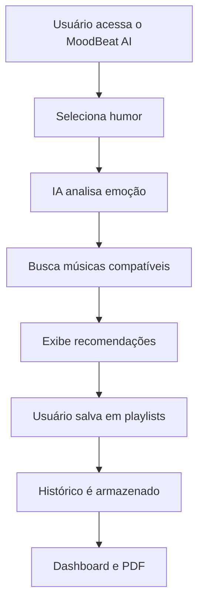

# 🎧 MoodBeat

> Transformando emoções em música através de Inteligência Artificial.

---

## 📖 Sobre o Projeto

O **MoodBeat** é uma plataforma web inteligente capaz de analisar o humor do usuário e recomendar músicas personalizadas com auxílio de Inteligência Artificial.

A proposta do projeto é unir tecnologia, música e bem-estar emocional em uma experiência moderna e interativa, permitindo que cada usuário encontre músicas compatíveis com seu momento emocional.

Além das recomendações musicais, o sistema também oferece:

* 📊 Histórico emocional
* 🎵 Gerenciamento de playlists
* 📈 Dashboard analítico
* 🤖 Análise de humor por IA
* 📄 Geração de histórico em PDF
* 📱 Interface responsiva e moderna

---

# 🚀 Funcionalidades

## 🔐 Autenticação

* Cadastro de usuários
* Login seguro
* Logout autenticado
* Criptografia de senhas com bcrypt

## 😊 Análise de Humor

* Seleção de humor por interface visual
* Processamento inteligente do estado emocional
* Análise por IA

## 🎶 Recomendação Musical

* Sugestões personalizadas
* Integração com API musical
* Exibição de:

  * título
  * artista
  * álbum
  * preview da música

## 📂 Playlists

* Criar playlists
* Adicionar músicas
* Editar playlists
* Excluir playlists

## 📊 Dashboard

* Histórico de humores
* Estatísticas musicais
* Recomendações rápidas
* Visualização gráfica dos dados

## 🎞️ Apresentação do Projeto

Acesse os slides oficiais do projeto MoodBeat AI no Canva:

[MoodBeat — Apresentação Oficial](https://canva.link/dwk65di4pp5eo4c?utm_source=chatgpt.com)


## 📄 Exportação PDF

* Geração automática do histórico emocional e musical em PDF

---

# 🧠 Como Funciona



---

# 🛠️ Tecnologias Utilizadas

## 💻 Back-end

* Node.js
* Express.js
* SQLite

## 🎨 Front-end

* HTML5
* CSS3
* JavaScript

## 🤖 Inteligência Artificial & APIs

* Axios
* APIs Musicais
* Cheerio

## 🔒 Segurança

* bcrypt

## 📊 Visualização

* Chart.js

---

# 🗄️ Estrutura do Banco de Dados

## Tabela: `users`

| Campo   | Tipo    |
| ------- | ------- |
| id_user | INTEGER |
| nome    | TEXT    |
| email   | TEXT    |
| senha   | TEXT    |

---

## Tabela: `moods`

| Campo   | Tipo    |
| ------- | ------- |
| id_mood | INTEGER |
| humor   | TEXT    |
| data    | DATE    |
| id_user | INTEGER |

---

## Tabela: `songs`

| Campo   | Tipo    |
| ------- | ------- |
| id_song | INTEGER |
| titulo  | TEXT    |
| artista | TEXT    |
| album   | TEXT    |
| genero  | TEXT    |

---

## Tabela: `playlists`

| Campo         | Tipo    |
| ------------- | ------- |
| id_playlist   | INTEGER |
| nome_playlist | TEXT    |
| id_user       | INTEGER |

---

# ⚡ Instalação

## Clone o repositório

```bash
git clone https://github.com/seuusuario/moodbeat-ai.git
```

## Entre na pasta

```bash
cd moodbeat-ai
```

## Instale as dependências

```bash
npm install
```

## Execute o projeto

```bash
npm start
```

---

# 📁 Estrutura do Projeto

```bash
MoodBeat-AI/
│
├── backend/
│   ├── routes/
│   ├── database/
│   ├── controllers/
│   └── server.js
│
├── frontend/
│   ├── pages/
│   ├── css/
│   ├── js/
│   └── assets/
│
├── docs/
├── README.md
└── package.json
```

---

# 👨‍💻 Equipe

| Integrante        | Função                      |
| ----------------- | --------------------------- |
| Pedro de Oliveira | Product Owner               |
| Isabella Radael   | Scrum Master / Documentação |
| Nicolas Fernandes | Desenvolvedor Full Stack    |
| Evellyn Silva     | Front-end / UX              |
| Giovanna Alves    | Front-end / Protótipo       |
| João Pedro        | Interface / Slides          |

---

# 📌 Metodologia

O projeto foi desenvolvido utilizando:

* Scrum
* Sprint Planning
* Product Backlog
* Sprint Backlog
* 5W2H

---

# 🎯 Objetivo

O MoodBeat busca oferecer uma experiência musical inteligente e emocionalmente personalizada, utilizando IA para aproximar tecnologia e sentimentos humanos.

---

# 📸 Preview

```txt
😊 Feliz → Pop / Indie / Dance
😔 Triste → Lo-fi / Piano / Acoustic
🔥 Motivado → Rock / Phonk / Trap
😌 Calmo → Jazz / Chill / Ambient
```

---

# 📄 Licença

Este projeto foi desenvolvido para fins acadêmicos.

---

# 🌌 MoodBeat

> “Sua emoção tem uma trilha sonora.” 🎵
